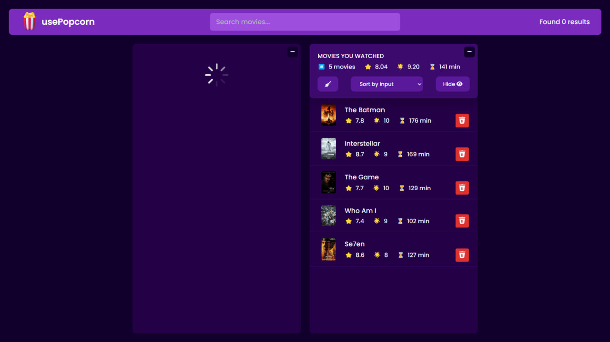
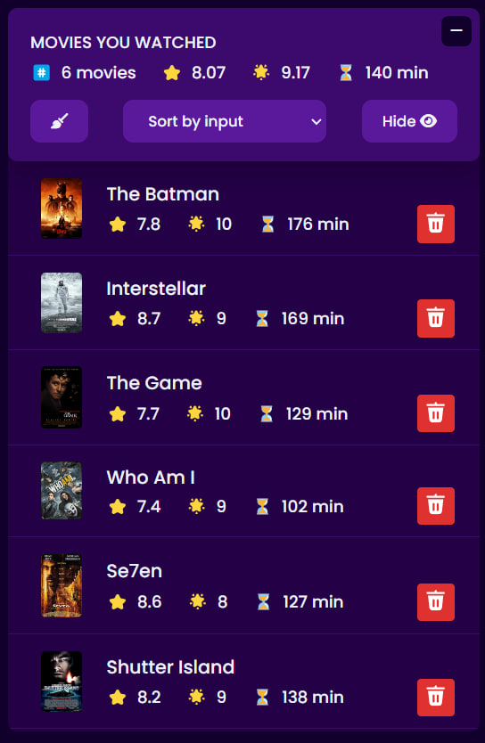

# 🎬 Movie React JS App

Welcome to **Movie React JS App**! 🌟 This is a simple and elegant movie discovery app built using React. It allows users to browse trending movies, search for their favorite films, and explore detailed movie information with ease.

🌐 **[Live Demo](https://movieariagdrz.netlify.app/)**

---

## ✨ Features

- **Trending Movies**: Browse the latest trending movies updated daily.
- **Search**: Quickly find any movie by title.
- **Movie Details**: View detailed information like plot, cast, ratings, and release date.
- **Responsive Design**: Optimized for both mobile and desktop users.
- **Favorites List**: Add movies to your favorites for easy access later.

---

## 🚀 Getting Started

### Prerequisites

Before running the app, ensure you have the following installed:

- Node.js (v14+)
- npm (v6+)

### Installation

1. Clone the repository:

   ```bash
   git clone https://github.com/ariyagoudarzi/movie-react-js-app.git
   ```

2. Navigate to the project directory:

   ```bash
   cd movie-react-js-app
   ```

3. Install dependencies:

   ```bash
   npm install
   ```

4. Start the app:

   ```bash
   npm start
   ```

   The app will be running on `http://localhost:3000`.

---

## 📸 Screenshots

Here are some screenshots of the app in action:

1. **Homepage** (Trending Movies)

   

2. **Search Movies**

   

3. **Movie Details**

   

4. **Responsive View** (Mobile)

   

5. **Favorites List**

   

---

## 🛠️ Technologies Used

- **React**: For building the UI.
- **CSS**: For styling the app.
- **API**: Fetch movie data using [The Movie Database (TMDb) API](https://www.themoviedb.org/).

---

## ⭐ Show Your Support

If you found this project helpful or interesting, please consider giving it a **star** on GitHub! ⭐

---

## 📄 License

This project is licensed under the MIT License. See the [LICENSE](LICENSE) file for details.
